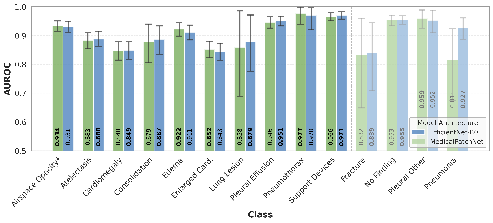
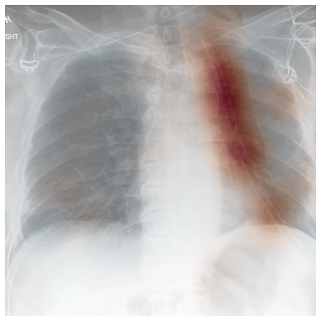
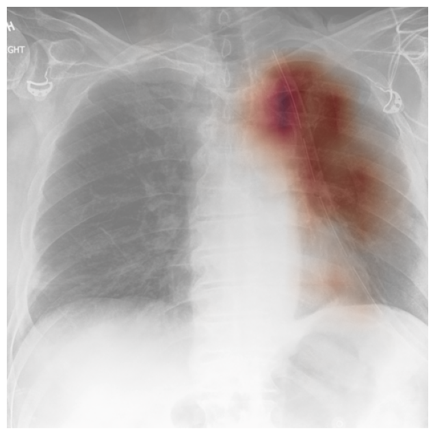
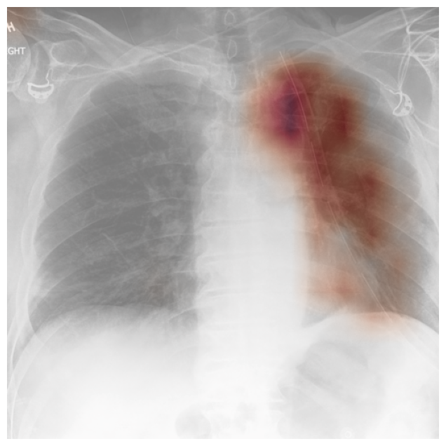
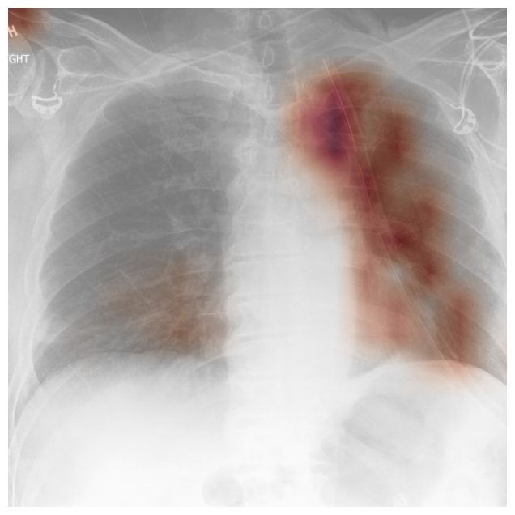

# MedicalPatchNet: A Patch-Based Self-Explainable AI Architecture for Chest X-ray Classification

[](https://python.org)
[](https://pytorch.org)
<!--TODO: Add [](LICENSE) -->

## Overview

MedicalPatchNet is a self-explainable deep learning architecture designed for chest X-ray classification that provides transparent and interpretable predictions without relying on post-hoc explanation methods. Unlike traditional black-box models that require external tools like Grad-CAM for interpretability, MedicalPatchNet integrates explainability directly into its architectural design.
The architecture divides chest X-ray images into patches, processes each patch independently using EfficientNet-B0, and aggregates predictions through averaging.

You can find the paper here: [TODO ADD LINK]

### Key Features

- **Self-explainable by design**: No need for external interpretation methods like Grad-CAM
- **Competitive performance**: Achieves comparable classification accuracy to standard EfficientNet-B0 (AUROC: 0.902 vs 0.911)
- **Superior localization**: Significantly outperforms Grad-CAM variants in pathology localization tasks (mean hit rate: 0.485 vs 0.376)
- **Clinical relevance**: Designed specifically for medical imaging applications where interpretability is essential
- **Faithful explanations**: Saliency maps directly reflect the model's true reasoning, not post-hoc approximations

---

## Quick Start

### Prerequisites


- **Python**: 3.10.4
- **Conda**: Installed and configured
- **Note**: We used Ubuntu 22.04

### Installation

1. **Clone the repository**

2. **Set up the conda environment**
   ```
   $ conda env create --name medical_patch_net --file=environment.yml
   ```

3. **Activate the environment**
   ```
   $ conda activate medical_patch_net
   ```

**Setup complete!** You're ready to start using MedicalPatchNet.

---


## Datasets

We evaluate MedicalPatchNet on two complementary datasets:

### CheXpert Dataset
- **Purpose**: Training and classification evaluation
- **Size**: 223,414 chest X-rays from 64,540 patients
- **Classes**: 14 distinct pathology classes
- **Access**: [Stanford ML Group - CheXpert](https://stanfordmlgroup.github.io/competitions/chexpert/)

### CheXlocalize Dataset
- **Purpose**: Localization and explainability evaluation
- **Features**: Radiologist-annotated segmentation masks
- **Based on**: CheXpert validation and test sets
- **Access**: [Stanford AIMI - CheXlocalize](https://stanfordaimi.azurewebsites.net/datasets/23c56a0d-15de-405b-87c8-99c30138950c)

---

## Data Preprocessing

To optimize data loading and training efficiency, we preprocess the images by:

1. **Ensuring square aspect ratio**
2. **Downscaling to 1024×1024 pixels**
3. **Saving the preprocessed dataset**

Execute the preprocessing script:
```
$ python3 preprocessing/preProcCheXpert.py
```

> **Note**: Modify the input and output paths in the script to match your system configuration.

---

## Training

### Running the Training Pipeline

Execute the complete training pipeline:

```
$ ./runTraining.sh
```

### Training Configuration

- **Image Resolution**: 512×512 pixels
- **Patch Configuration**: 8×8 patches (64×64 pixels each)
- **Backbone**: EfficientNet-B0 with ImageNet-1k pretraining
- **Optimizer**: AdamW with OneCycle learning rate schedule
- **Training Duration**: 20 epochs (~4h in total on NVIDIA H100; similar to EfficientNet-B0)
- **Hardware Requirements**: 6GB VRAM is sufficient for configuration in `runTraining.sh`. We used NVIDIA H100 (94GB VRAM) for training.

---

## Model Weights Download

If you don't want to train the network yourself, we also provide our weights on Hugging Face: [https://huggingface.co/patrick-w/MedicalPatchNet](https://huggingface.co/patrick-w/MedicalPatchNet)

You can also directly download them here:

[**MedicalPatchNet**](https://huggingface.co/patrick-w/MedicalPatchNet/resolve/main/MedicalPatchNet_weights.pt)

[**EfficientNet-B0**](https://huggingface.co/patrick-w/MedicalPatchNet/resolve/main/EfficientNetB0_weights.pt) (baseline; used for Grad-CAM, Grad-CAM++, and Eigen-CAM)

Download the weights and place them in the `savedModels` directory for evaluation.

To evaluate on our trained models, use:

```
./runEval.sh
```

---

## Evaluation

### Classification Performance

Classification performance is evaluated automatically at the end of training (see [`trainClassification.py`](trainClassification.py#L288)).

> **Note**: The evaluation code is tailored for the final versions of MedicalPatchNet and EfficientNet-B0.

**Key Metrics**:
- **AUROC** (Area Under ROC Curve)
- **Accuracy, Sensitivity, Specificity** (optimized thresholds from validation set)
- **Confidence intervals** via bootstrapping (100,000 resamples)

### Localization Evaluation

For pathology localization assessment, we use the CheXlocalize evaluation code:

1. **Generate model outputs**:
   ```
   $ python3 evalClassification.py
   ```

2. **Install CheXlocalize evaluation code**:

    [See here for instructions](https://github.com/rajpurkarlab/cheXlocalize/tree/v1.0.0)

3. **Enhanced threshold optimization**:
   
   The original CheXlocalize code only tests [specific threshold values](https://github.com/rajpurkarlab/cheXlocalize/blob/v1.0.0/tune_heatmap_threshold.py#L63C1-L63C40). We use ternary search for more fine-grained optimization:
   
   - Copy our optimized script: [`tune_heatmap_threshold_opt.py`](tune_heatmap_threshold_opt.py) into the CheXlocalize folder
   - Use it instead of the original [`tune_heatmap_threshold.py`](https://github.com/rajpurkarlab/cheXlocalize/blob/v1.0.0/tune_heatmap_threshold.py)

4. **Run CheXlocalize evaluation code**

    [See here for instructions](https://github.com/rajpurkarlab/cheXlocalize/tree/v1.0.0)

---

## Results

### Classification Performance Comparison



**Figure 1**: Comparison of the Area Under the Receiver Operating Characteristic (AUROC) curves for MedicalPatchNet and EfficientNet-B0, indicating similar classification performance. On the CheXlocalize dataset, both models yield mean AUROCs of 0.907 and 0.908, respectively; for the full 14-class CheXpert dataset, AUROCs are 0.902 and 0.911, respectively. (*) Note: The *Lung Opacity* class in CheXpert is termed *Airspace Opacity* in CheXlocalize.

**Table 1**: Performance comparison between MedicalPatchNet and EfficientNet-B0. The metrics represent average values computed across the 10 classes from the CheXlocalize dataset (*) and across all 14 classes from the CheXpert dataset (All).

| Model           | AUROC (*)| AUROC (All) | Accuracy (*)| Accuracy (All) | Sensitivity (*)| Sensitivity (All) | Specificity (*)| Specificity (All) |
|:----------------|:--------:|:-----------:|:-----------:|:--------------:|:--------------:|:-----------------:|:--------------:|:-----------------:|
| MedicalPatchNet |  0.907   |    0.902    |  **0.836**  |   **0.848**    |     0.825      |       0.763       |   **0.841**    |     **0.851**     |
| EfficientNet-B0 |**0.908** |  **0.911**  |    0.823    |     0.843      |   **0.834**    |     **0.798**     |     0.826      |       0.844       |
| Difference      |  -0.001  |   -0.009    |    0.013    |     0.005      |     -0.009     |      -0.035       |     0.015      |       0.007       |

### Explainability Comparison

Our patch-based approach provides superior localization compared to traditional post-hoc methods:

| **Label** | **Value** | **MedicalPatchNet (Raw)** | **Grad-CAM** | **Grad-CAM++** | **Eigen-CAM** |
|---------------|-----------|---------------------------|--------------|----------------|---------------|
| **Pleural Effusion** | 1 |  |  |  |  |
| **Pleural Effusion** | 0 |  |  |  |  |
| **Support Devices** | 1 |  |  |  |  |
| **No Finding** | 0 |  |  |  |  |
| **Pneumothorax** | 0 |  |  |  |  |
| **Support Devices** | 1 |  |  |  |  |

### Saliency Map Interpretation

- **Red regions**: Indicate evidence **supporting** the presence of the finding
- **Blue regions**: Indicate evidence **against** the presence of the finding  
- **White regions**: Neutral areas with minimal influence on the decision

### Quantitative Results

**Table 2**: Hit rate of different saliency methods evaluated on the CheXlocalize dataset. MedicalPatchNet demonstrates superior performance in nine out of the ten analyzed classes. Bold indicates the highest score, and underlining indicates the second-best score for each pathology.

| Pathology         | MedicalPatchNet (Scaled) | MedicalPatchNet (Raw) | Grad-CAM | Grad-CAM++ | Eigen-CAM |
|:------------------|:------------------------:|:---------------------:|:--------:|:----------:|:---------:|
| Airspace Opacity  |        **0.493**         |         0.395         | <u>0.424</u>  |   0.414    |   0.376   |
| Atelectasis       |        **0.490**         |         0.389         | <u>0.406</u>  |   0.367    |   0.373   |
| Cardiomegaly      |        **0.464**         |         0.269         | <u>0.376</u>  |   0.246    |   0.217   |
| Consolidation     |        **0.540**         |         0.482         | <u>0.516</u>  |   0.401    |   0.433   |
| Edema             |        <u>0.648</u>         |         0.601         | **0.650**|   0.471    |   0.518   |
| Enlarged Card.    |        **0.419**         |         0.320         | <u>0.392</u>  |   0.349    |   0.322   |
| Lung Lesion       |          0.281           |       **0.564**       |  0.216   |   0.284    | <u>0.354</u>   |
| Pleural Effusion  |        **0.466**         |       <u>0.372</u>       |  0.308   |   0.293    |   0.207   |
| Pneumothorax      |        <u>0.498</u>         |       **0.794**       |  0.195   |   0.195    |   0.097   |
| Support Devices   |        <u>0.409</u>         |       **0.668**       |  0.272   |   0.225    |   0.130   |
| **Mean**          |        <u>0.471</u>         |       **0.485**       |  0.376   |   0.325    |   0.303   |

**Table 3**: Mean intersection over union (mIoU) averaged across true positives (TP), false positives (FP), and false negatives (FN), and reported separately for true positives (TP only). Bold indicates the highest score, and underlining indicates the second-best score.

| Included Cases | MedicalPatchNet (Scaled) | MedicalPatchNet (Raw) | Grad-CAM | Grad-CAM++ | Eigen-CAM |
|:---------------|:------------------------:|:---------------------:|:--------:|:----------:|:---------:|
| TP, FP, FN     |        **0.069**         |       <u>0.056</u>       |  0.052   |   0.054    |   0.049   |
| TP only        |          0.168           |         0.164         | <u>0.227</u>  | **0.238**  |   0.215   |

### Performance Difference Explanation

Our results differ from those reported in the original CheXlocalize paper due to methodological differences:

**Our approach**: We trained single models (one MedicalPatchNet and one EfficientNet-B0) and evaluated their individual performance.

**CheXlocalize paper approach**: The authors trained 120 checkpoints for each of their 3 tested models, selected the top 10 performing checkpoints per pathology, and created ensemble models from these selections. This ensemble approach naturally yields superior performance compared to single model evaluation [[1]](https://doi.org/10.1038/s42256-022-00536-x).

**Note**: The preprint version of the CheXlocalize work [[2]](https://www.medrxiv.org/content/10.1101/2021.02.28.21252634v1) shows single network performance that is comparable to our results, supporting our interpretation that the performance differences are primarily due to ensemble vs. single model evaluation.

The performance differences reflect this methodological distinction rather than fundamental limitations of our approach. Our focus is on demonstrating the interpretability advantages of MedicalPatchNet using a single-model comparison framework.

## Citation

If you use MedicalPatchNet in your research, please cite our work:

```bibtex
[TODO ADD CITATION]
```

---

## Experimental Details

During development, we conducted 31 experimental training runs to refine the model architecture and tune hyperparameters. These experiments included:

-   **Augmentations**:
    -   Experimenting with data augmentation using random black patches (cutout), which was ultimately discarded.

-   **Hyperparameter Tuning**:
   -   **Learning Rates**: `1e-3`, `1e-4`, and `1e-5`.
   -   **Epochs**: 3, 10, and 20.
   -   **Batch Sizes**: 8, and 16 images.

All experimental models were evaluated exclusively on the validation set to guide development. The final reported performance was measured on the test set only once to ensure an unbiased assessment.

## References

[1] Saporta, A., Gui, X., Agrawal, A. et al. Benchmarking saliency methods for chest X-ray interpretation. Nat Mach Intell 4, 867–878 (2022). https://doi.org/10.1038/s42256-022-00536-x

[2] Saporta, A., Gui, X., Agrawal, A. et al. Deep learning saliency maps do not accurately highlight diagnostically relevant regions for medical image interpretation. medRxiv (2021). https://www.medrxiv.org/content/10.1101/2021.02.28.21252634v1


